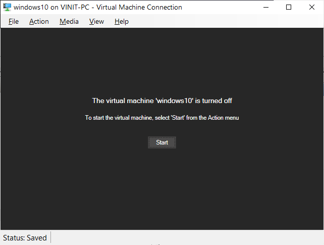
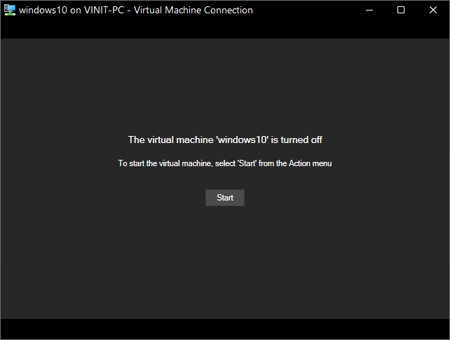

# HyperV Dark Mode

HyperV Dark Mode is a simple Python script that allows you to enable dark mode for the Virtual Machine Connection window in Hyper-V. This can help reduce eye strain, especially for developers who spend long hours working on virtual machines in a bright environment.

## Features

- Turns the Virtual Machine Connection window into a completely dark mode interface.
- Improves visibility and reduces eye strain during development in Hyper-V.

## Prerequisites

- Windows operating system (Windows 10 or higher).
- Python 3.x installed on your system.
- Administrator privileges to run the script.

## Screenshots

### Light Mode

### Dark Mode

## Contributing

Contributions are welcome! If you have any suggestions or improvements, please open an issue or submit a pull request.

---

**Disclaimer:** This is very rough script, we can use it has hobby testing and workaround. Happy coding !! 

